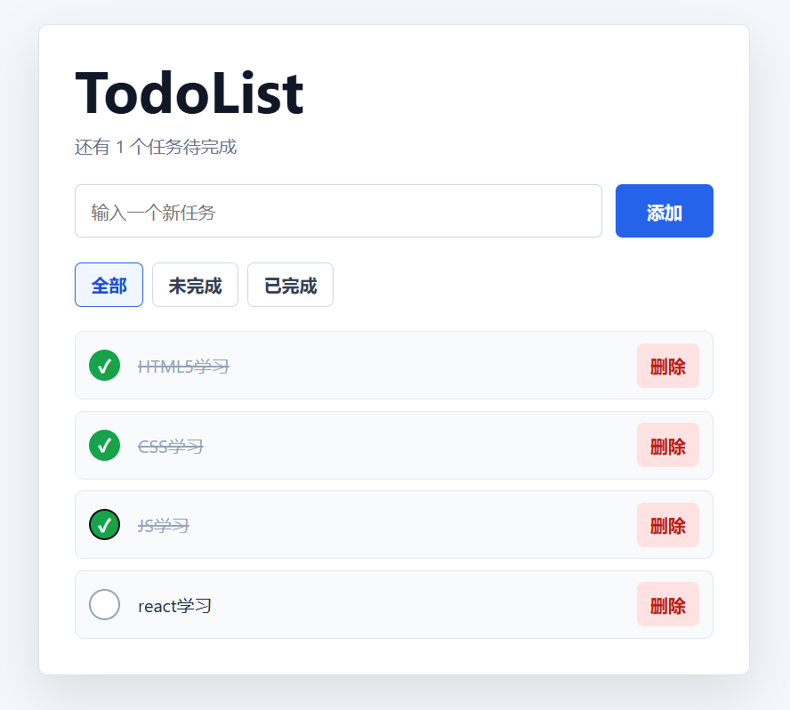
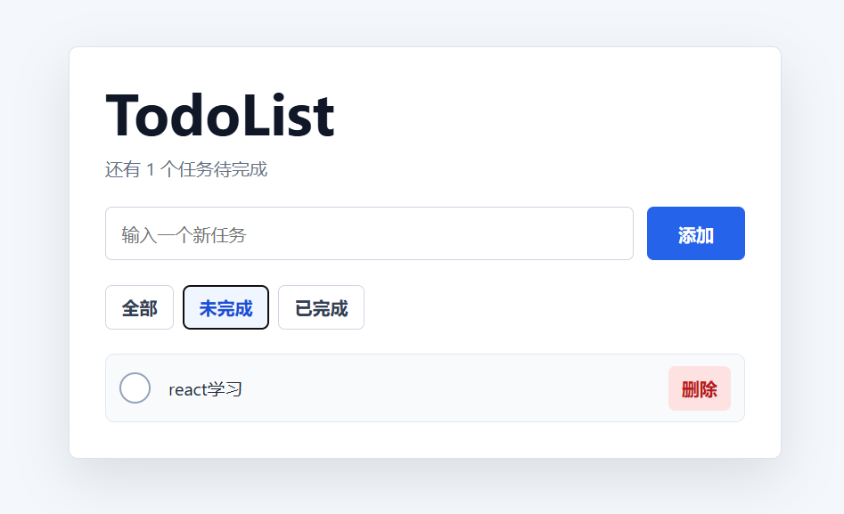
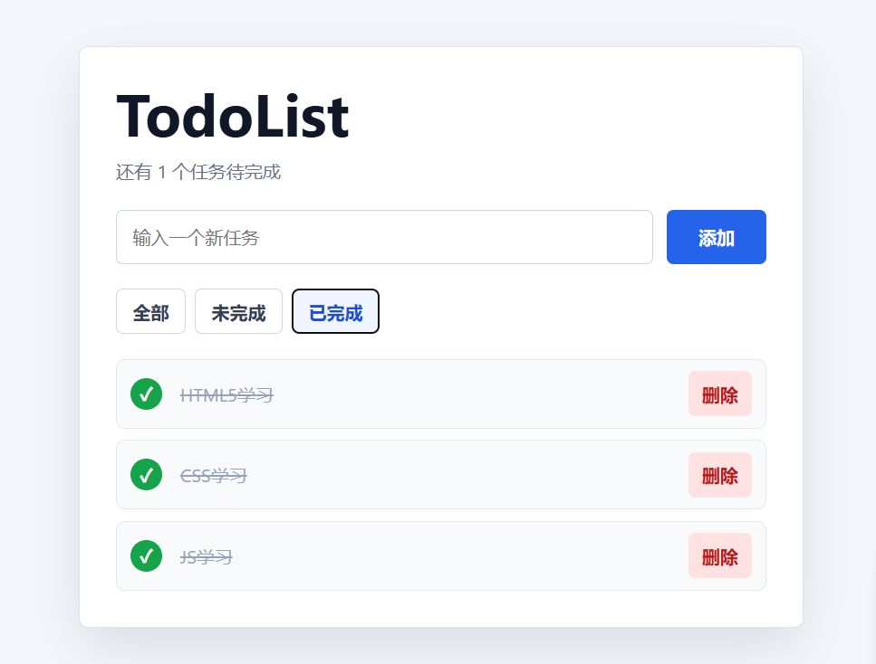

# React TodoList 任务管理应用

一个基于 **React** 构建的任务管理（TodoList）单页应用，支持任务新增、删除、状态切换与筛选功能，并实现本地数据持久化存储。

---

# 项目结构

~~~
react-todolist
│
├── src
│   │
│   ├── components
│   │   ├── TodoInput.jsx
│   │   ├── TodoItem.jsx
│   │   ├── TodoList.jsx
│   │   └── Filter.jsx
│   │
│   ├── App.jsx
│   ├── main.jsx
│   └── index.css
│
├── screenshots
│   └── 1.png
│   ├── 2.png
│   └── 3.png
|
├── package.json
└── README.md
~~~

---

## 效果截图



---



---



---

# 技术栈

本项目主要使用：

- React（函数组件）
- React Hooks  
  - useState  
  - useEffect
- JavaScript（ES6+）
- CSS3
- LocalStorage（本地数据存储）

---

#  功能特性

本项目实现了一个基础但完整的 TodoList 应用，包含以下核心功能：

##  添加任务

用户可在输入框中输入任务内容，并点击按钮添加任务。

实现要点：

- 通过 `useState` 管理任务输入内容
- 点击按钮时更新任务数组状态
- 页面实时渲染新增任务

---

##  删除任务

每个任务项都支持删除操作。

实现要点：

- 为每个任务绑定删除按钮
- 通过任务 `id` 定位目标任务
- 更新 state 并重新渲染列表

---

## 完成状态切换

用户可以标记任务为：

- 已完成
- 未完成

实现要点：

- 为任务添加 `completed` 字段
- 点击任务时切换状态
- 根据状态动态修改样式

例如：

```js
{
  id: 1,
  text: "学习 React",
  completed: false
}
```

## 任务筛选功能

支持三种筛选模式：

- 全部（All）
- 已完成（Completed）
- 未完成（Active）

实现要点：

- 使用状态记录当前筛选类型
- 根据筛选条件过滤任务数组
- 动态渲染符合条件的任务列表

---

## 本地数据持久化

刷新页面后任务不会丢失。

实现要点：

使用 `localStorage` 保存任务数据：

```react
useEffect(() => {
  localStorage.setItem("todos", JSON.stringify(todos));
}, [todos]);
```

初始化时读取：

```
const savedTodos =
  JSON.parse(localStorage.getItem("todos")) || [];
```

---

